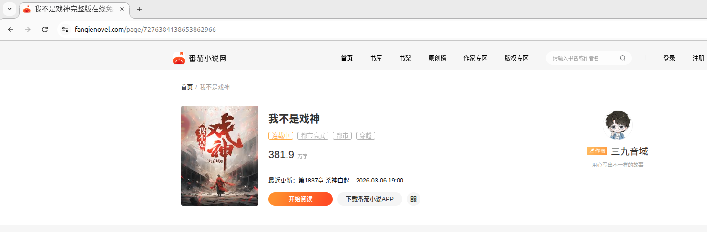

# NovelDownloader
python3.10+
## 介绍
一个有多种下载模式的小说下载器，支持多种平台的小说内容提取和多种方式保存，并可以下载封面与插图。    
## 功能
- 搜索下载  
- 群组，用户：将下载的文件归类至对应用户和群组当中  
- 插图下载  
- 下载模式：Chrome，API，Requests  
- 网站支持：
  - 番茄  
  - 起点  
  - 笔趣阁(www.biqugequ.org)  
- 格式支持：
  - txt  
  - json
## 一般操作
下载前检查：
  - 首先是否已有[Chrome](https://www.google.cn/intl/zh-CN/chrome/)浏览器  
  - 是否已经登录  
  - 下载之前需要获取小说相关链接，然后输入到程序中。(链接支持目录页和分享链接)  
    - 目录页：浏览器上页面含有名称和封面图片的  
      
    
    - 分享链接：在平台APP阅读页的(系统)分享链接，如果很短的话，然后打开，搜索栏就会有长长的字符串，这个就是目标链接  
      
  - 也可以通过搜索功能下载，但现仅支持Chrome模式的搜索功能  
## 注意事项
- 下载有时因网站的反爬虫机制有时会弹出验证码，需自行解决  
- **此下载器无法下载未解锁的章节！**（API模式除外）  
## Android
其实并没有真正的安卓版，是在手机上用终端模拟器运行的，当然功能并不齐全，所以只是娱乐性质的。以[Termux](https://github.com/termux/termux-app)为例，最好还是要有一点命令行基础的  
如果想要在手机上运行，可以试一试。如果要使用Requests模式，仍然需要电脑辅助获取cookies  
- 进入 Termux 家目录
```shell
cd ~
```
- 更新包
```shell
pkg update && pkg upgrade -y
```
- 安装必要的包
```shell
pkg install git python3 -y
```
- 创建名为 nd 的python虚拟环境并且激活它
```shell
python3 -m venv nd && source nd/bin/activate
```
- 克隆项目，进入项目内部
```shell
git clone https://github.com/canyang2008/NovelDownloader.git && cd NovelDownloader
```
- 先安装必要的依赖
```shell
pkg install clang libxml2 libxslt python-psutil -y
```
- 安装依赖库
```shell
pip install -r req_termux.txt
```
- 由于termux内部文件默认与本地存储隔离，所以需要赋予存储权限然后打通连接
```shell
termux-setup-storage
```
手机文件夹位置：`~/storage/shared`  
在手机新建一个文件夹，名为nd_Bookstore，来存储下载的小说文件
```shell
mkdir ~/storage/shared/nd_Bookstore
```
- 然后就可以执行了
```shell
python3 main.py
```
下载完成之后复制整个Bookstore文件夹到手机的nd_Bookstore文件夹
```shell
cp -r ~/NovelDownloader/data ~/storage/shared/nd_Bookstore
```
- 设置命令 nd_run 可以快捷执行
```shell
echo "alias nd_run='source ~/nd/bin/activate; cd ~/NovelDownloader; python3 main.py'" >> ~/.bashrc
```
## 常见问题
- **BUG多**  
  独立制作，学业为重，请见谅  
- **浏览器**  
  - 安全：本程序自成用户数据目录，在大多数状态下不主动访问本地用户数据
- **API**
  API仅有番茄的，后续会添加
  - FqRead(oiapi)：  
    - 使用之前需先获取apikey，访问API官网获取apikey(https://oiapi.net/)，加入QQ群聊，找到机器人卡特获取
    - [API文档](https://oiapi.net/doc/id/115.html)
## 关于反病毒误报说明
本程序操作 Chrome操作，这与某些病毒的运行方式类似，所以容易误报。  
如果对本程序不放心，请使用其他同类型的产品。  
如果对此项目不满意的可以使用别的项目，大多数比我的优秀，不要坏了自己的心情

## 免责声明
本程序仅用于Python网络爬虫与网页处理技术的教育与研究目的。请勿用于任何非法活动或侵犯他人权益的行为。用户需自行承担使用本程序可能产生的法律责任与风险。  

**使用前请确保遵守相关法律法规与网站使用政策，如有疑问请咨询法律顾问。**  

作者：canyang2008