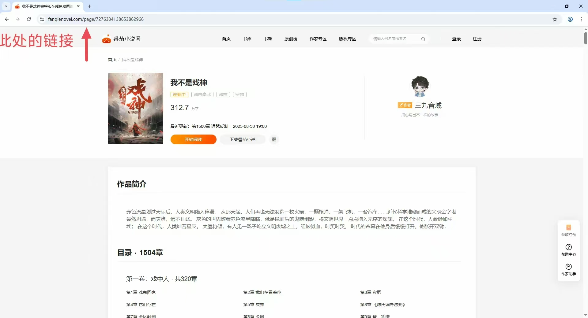
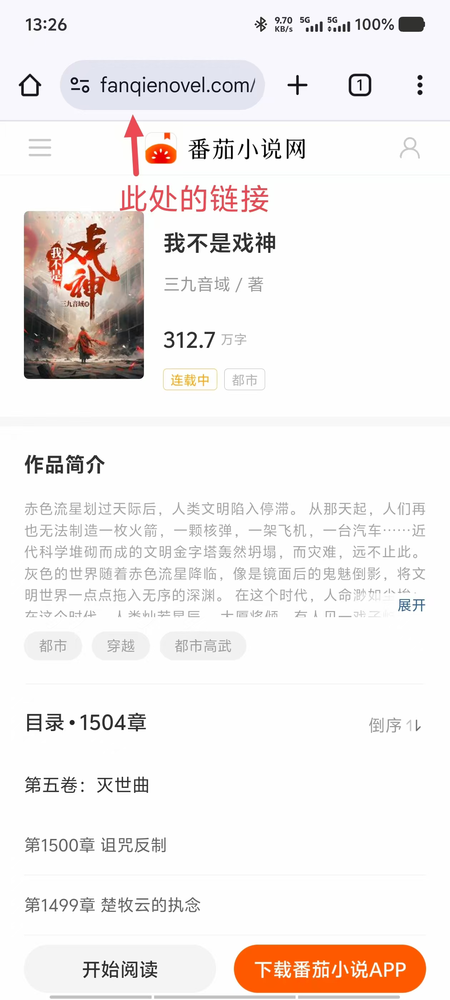
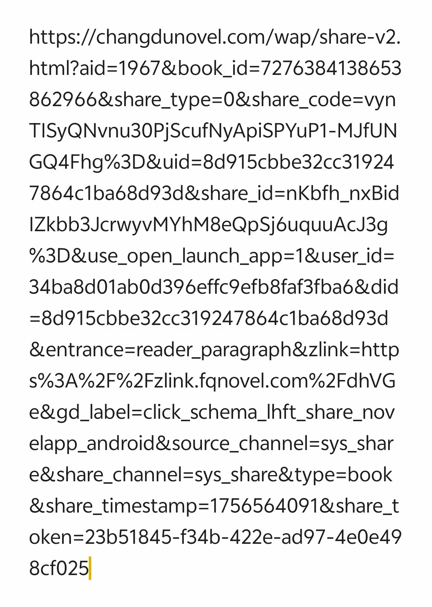
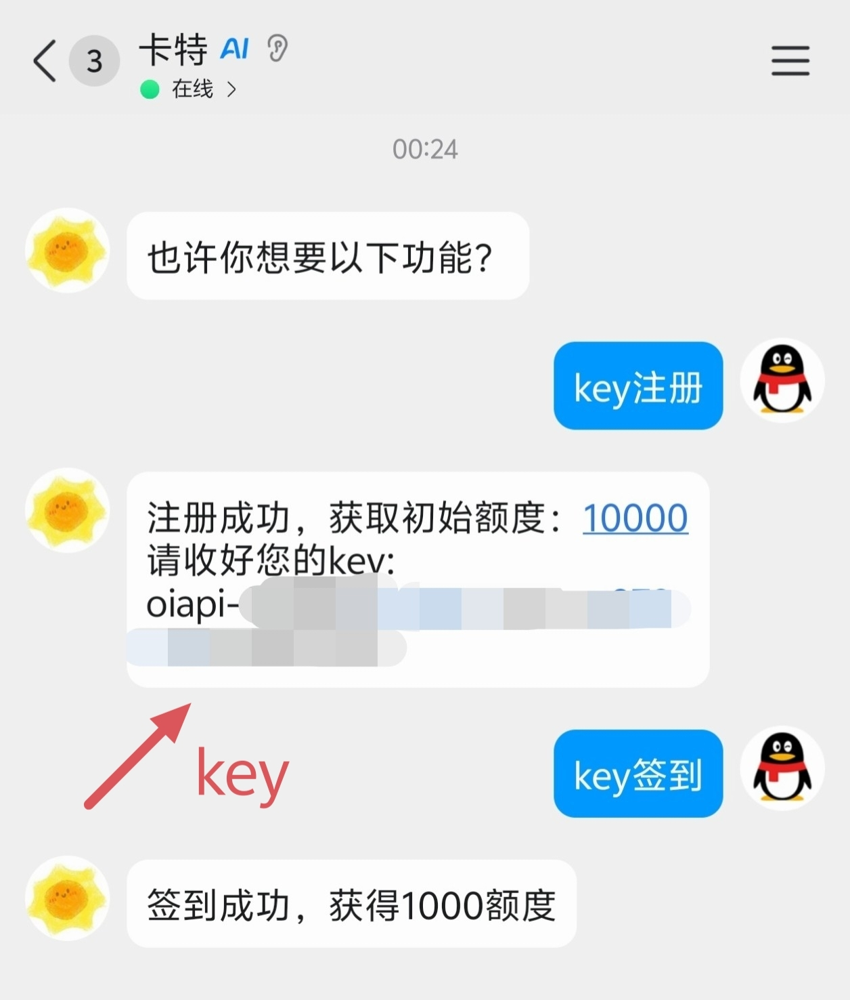

# NovelDownloader

一个基于 Chrome 浏览器或API获取的小说内容抓取与下载工具，支持多种平台的小说内容提取，并可以下载封面与插图。  
支持的平台：

- 番茄小说网
- 起点中文网
- 笔趣阁小说网

获取模式：

- Chrome
- API（仅番茄）

## 功能特点

- 📖 小说内容抓取：通过模拟浏览器行为和API提取小说文本与图片

- 👥 多账户与分组管理：支持创建不同账户与分组管理小说内容

- 💾 多种保存格式：支持 JSON、TXT、HTML 等多种输出格式，统一管理重要的json

- 🖼️ 插图下载： Chrome 可同时下载小说封面与章节插图

- ⚙️ 灵活配置：可自定义下载参数与存储路径

## 前置准备

1.电脑需要Chrome程序  
2.您需要备好VIP或已订阅章节(Chrome模式)，否则无法下载完整小说

## 快速开始

### 基本使用

运行程序后，您可以通过以下选项进行操作：
0.登录网站 - 登录目标网站以获取网站账号下可直接获取的小说

1.更新小说 - 根据配置文件更新已存储的小说内容

2.单本下载 - 下载单本小说

3.批量下载 - 读取 urls.txt 文件批量下载多本小说

4.指定章节 - 下载特定章节范围的内容

5.设置 - 管理账户与分组配置

6.备份 - 备份用户下的配置文件和小说资源

使用前最好登录网站  

### 如何获取小说链接

- **电脑版界面**

<br>

<br>

- **手机版界面**

<br>
<br>

- **同时也支持分享链接**（*即“系统分享”的链接*）

<br>
<br>

### 下载示例

在程序内填入
```text
https://fanqienovel.com/page/7276384138653862966
```
在外部调用(Python)
```text
python main.py --url=https://fanqienovel.com/page/7276384138653862966 --update=True --range=1,3-5,7-9
```


## 获取模式

### 获取小说资源有两种方式，各有优劣

### 番茄

- **浏览器**
  ✅优：
  - 可下载插图
  - 即访问即获取
  - 无获取上限
  - ……
  
  ⚠️缺：
  - 网络要求高
  - 需要vip
  - 响应慢
  - 验证码拦截
  - ……
- **API**
  ✅优：
  - 响应快
  - 网络要求低
  - ……

  ⚠️缺：
  - 不能下载插图
  - **需要apikey**
  - 有获取次数上限
  - ……

### apikey获取

1.访问此API官网链接点击“联系我们”加入Q群  
2.找到QQ机器人卡特，私聊进行操作获取key  
3.在程序内填入即可  

  <br>
  **演示**
  
*API官网链接：https://oiapi.net*  
  *API项目链接：https://oiapi.net/doc/?id=115*

## 配置说明

### 浏览器说明

本程序初次使用时，将会自行创建独立的浏览器数据，请您进行相关操作如登录等  
浏览器数据目录：`data/Local/<User>/User Data`
*`<User>`:当前User*

### 配置文件位置

账户管理配置：`data\Local\manage.json`

账户配置：`data\Local\UserConfig.json`

分组成员配置：`data\Local\json\mems.json`

### 输出格式说明

- JSON格式：保留完整小说信息与图片数据（Base64编码）

- TXT格式：纯文本格式，支持按章节或文件大小分割

- HTML格式：带阅读器界面的HTML文件

## 注意事项

- 当前账户功能与分组功能类似，无密码，无加密

- 在 *初期* 运行时会有多个验证码弹出（平均每50-100章一个），但会逐渐消失

- 如需在Chrome模式下下载完整内容，您需要具备相应平台的 VIP 权限或已订阅相关章节

## 常见问题

### ❓ BUG过多

独自一个人制作的项目，难免力不从心，请见谅。

### ❓ 配置文件&&浏览器数据安全

作者不可能也不会，本程序透明，可以完全经受住考验  
若不信任，请移步至其他同类型工具

### ❓ HTML文件加载缓慢

当小说含有大量图片时，生成的图片嵌入式HTML文件可能较大，加载需要较长时间（144MB文件约需2-3分钟加载）

### ❓ 配置文件丢失

如果`mems.json` | `UserConfig.json` | `mems.json`文件丢失或损坏，全部需要重新下载小说内容，建议定期备份此文件。

## 免责声明

本程序仅用于Python网络爬虫与网页处理技术的教育与研究目的。请勿用于任何非法活动或侵犯他人权益的行为。用户需自行承担使用本程序可能产生的法律责任与风险。

**使用前请确保遵守相关法律法规与网站使用政策，如有疑问请咨询法律顾问。**

## 作者信息

- **作者**：Canyang2008

- **群**：QQ 765857967

欢迎提出建议与新的功能想法！
